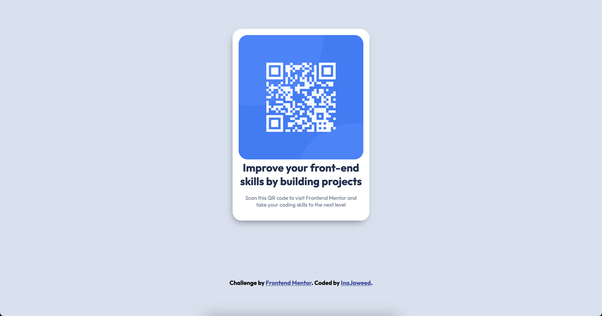

# Frontend Mentor - QR code component sokution

## Table of contents

- [Overview](#overview)
  - [Screenshot](#screenshot)
  - [Links](#links)
- [My process](#my-process)
  - [Built with](#built-with)
  - [What I learned](#what-i-learned)
  - [Continued development](#continued-development)
  - [Useful resources](#useful-resources)
- [Author](#author)
- [Challenge](#challenge)

## Overview

### Screenshot

### Links

  <h3>
    <a href="https://inajaweed.github.io/frontendmentor-QR-code-component/" color="white">
      Live Website
    </a>
     | 
    <a href="https://www.frontendmentor.io/profile/InaJaweed">
      Frtontend-mentor Profile 
    </a>
    | 
    <a href="https://www.frontendmentor.io/challenges/qr-code-component-iux_sIO_H">
      Challenge
    </a>
  </h3>

 
 
 

## My Process
### Built with

- Semantic HTML5 Markup
- CSS custom properties

### What I learned

Learnt basic HTML5 and CSS properties.

I learned how to center a div and how to use CSS properties.

### Continued development

I want to learn and understand more HTML elements and CSS properties and how to position divs easier.
I also would like to learn about different units such as rem, em and px.

I want to master HTML5 and CSS before I start on JavaScript and learn frameworks like react.

### Useful resources

- [W3schools](https://www.w3schools.com/html/default.asp) - Helped me start and understand HTML5 elements
- [W3schools](https://www.w3schools.com/css/default.asp) - Helped me start and understand CSS properties

### Author

- Frontend Mentor - [@InaJaweed](https://www.frontendmentor.io/profile/InaJaweed)
### Challenge
**To do this challenge, you need a basic understanding of HTML and CSS.**

The challenge was to build out this QR code component and get it looking as close to the design as possible.
You can use any tools you like to help you complete the challenge. 

**Try this challange yourself and have fun building!** 🚀
